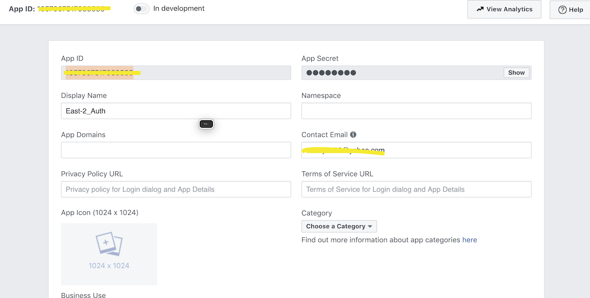
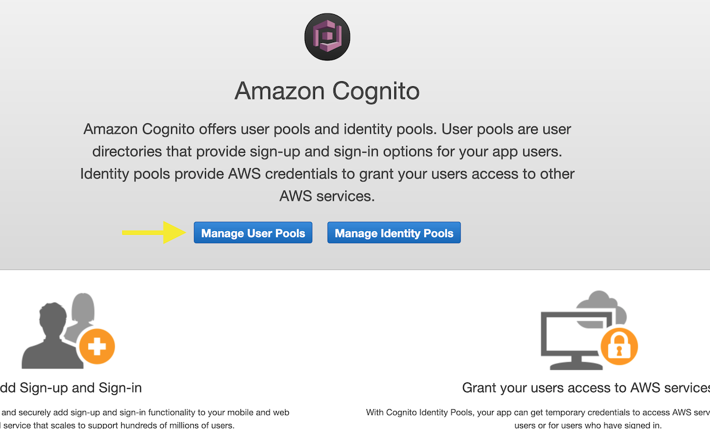
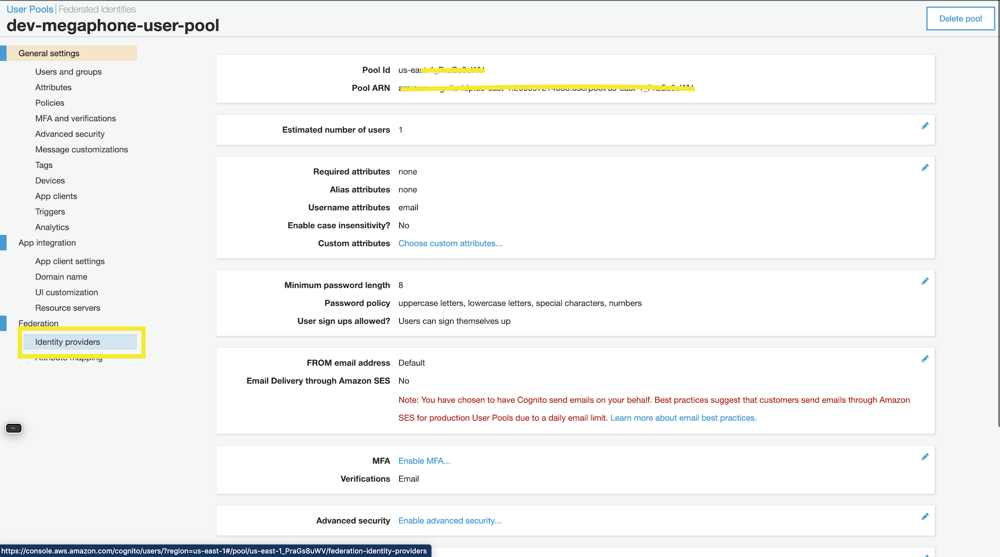
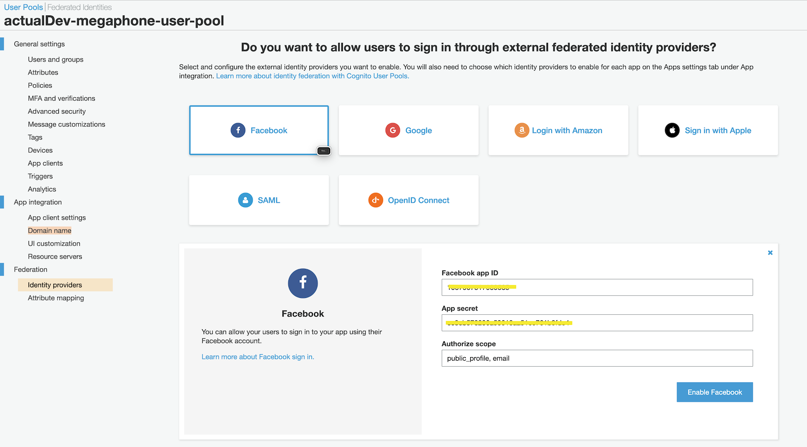
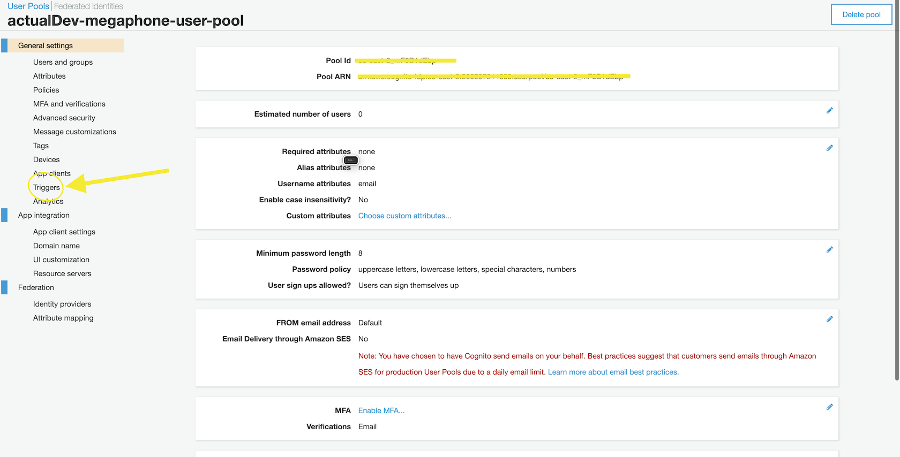
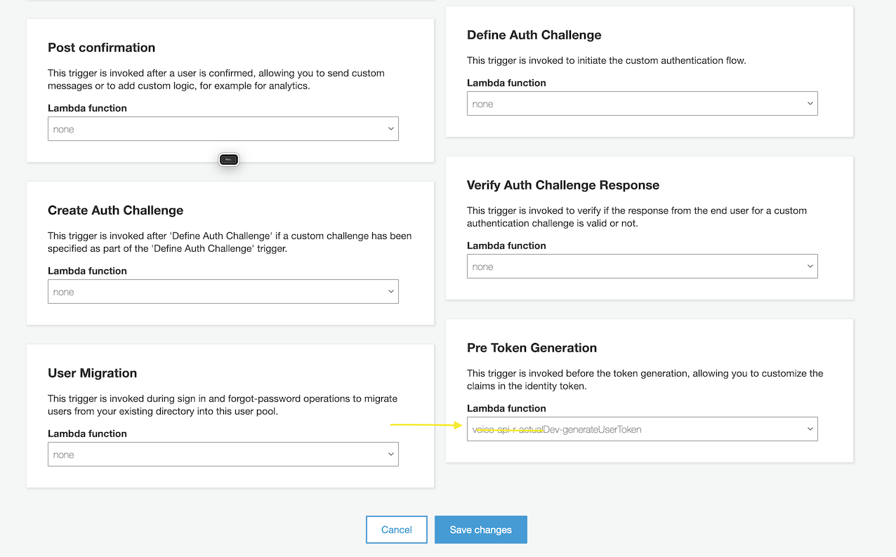
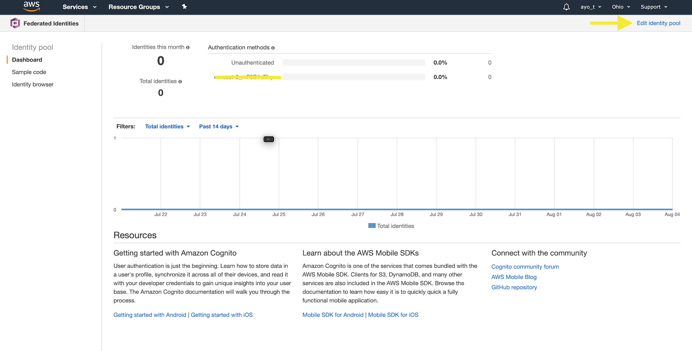
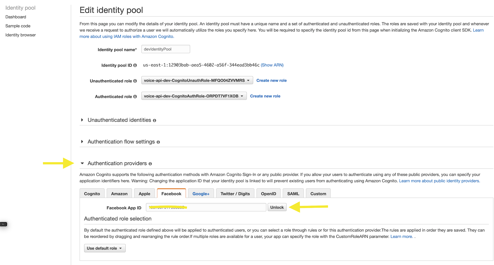
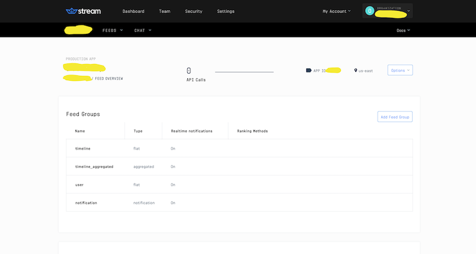

# SETUP GUIDE

Hi there!
This is a simple guide to walk you through setting up a personal version of Olog.me for development and tests. As such we would only cover a working version of the **Dev Environment**.
This guide assumes you are familiar with the Serverless Framework and the AWS console and social login. You can get familiar by completing this **[course](https://serverless-stack.com/)** . It also goes without saying that we assume you also like the fine things in life. This last sentence means you use VSCode.

---

## Initial Setup

---

Start by forking the Repo.

Clone your Fork and navigate to the directory.

Set the original repo as your upstream

```bash
$ git remote add upstream git@gitlab.com:danieloi/voice-api.git
```

Retrieve your AWS credentials

```bash
$ cat ~/.aws/credentials
```

The output should look something like this.

```
[default]
aws_access_key_id = YOUR_IAM_ACCESS_KEY
aws_secret_access_key = YOUR_IAM_SECRET_KEY
```

Head over to [getstream.io](https://getstream.io/) and create a free account. Create an app and copy the app information.

Create a .env file with the following fields. The fields marked _TBC_ will be completed with the results of the stack outputs on deployment.

```
ACCESS_KEY_ID=YOUR_IAM_ACCESS_KEY
SECRET_ACCESS_KEY=YOUR_IAM_SECRET_KEY
REGION=YOUR_AWS_REGION
USER_POOL_ID=TBC
APP_CLIENT_ID=TBC
IDENTITY_POOL_ID=TBC
dev_GETSTREAM_SECRET=YOUR_GETSTREAM_SECRET
dev_GETSTREAM_APP_ID=YOUR_GETSTREAM_ID
dev_GETSTREAM_KEY=YOUR_GETSTREAM_KEY
actualDev_GETSTREAM_APP_ID=Check with supreme
actualDev_GETSTREAM_SECRET=Check with supreme
actualDev_GETSTREAM_KEY=Check with supreme
```

Deploy the Api and copy the stack outputs to cpomplete the .env fields.

```bash
$ serverless deploy -v
```

---

## Social Login

---

The complete app as we know it includes Facebook, Google and Email signup. We will include these on the AWS Console.

Head over to [Facebook Developer Console](https://developers.facebook.com/) and create an app, `For Everything Else`. `You may use an existing app to setup`. Follow the prompt and retrieve your client ID and client Secret from the dashboard (Under `Basic Settings`).



Head over to [Google Cloud Console](https://console.cloud.google.com/) and create a new Project.

Retrieve the `Client Id` and `Client Secret`. We shall need this inforation in the next section.

Head over to Cognito and select `Manage User Pools`



You should find a user pool named `dev-megaphone-user-pool`. We shall be making a few changes to it.

First, we shall add our Facebook and Google Apps as Identity Providers. You should find `Identity Providers` near the bottom of the menu on th left portion of the screen.



Select Facebook on and paste your App ID and APP secret in the fields provided.



Paste `public_profile, email` in the _Authorize Scope_ field and click on the `Enable Facebook` Button.

We would repeat the above step for Google and paste `profile email openid` in the _Authorize Scope_ field.


Finally, click on `Triggers` under general settings.



Find the `Pre Token Generation` card (at the bottom right) and select your `generateUserToken` function from the list of functions.



It should bear the following format: `app_name-generateUserToken`.

---

Return to the Cognito Home Page and select `Manage Identity Pools`.

Our Identity Pool should be named `devIdentityPool`. Select it to navigate to its information page.



We shall begin editing the Identity Pool. You should find `Edit Identity Pool` at the top right corner.

Under `Authentication Providers`, select Facebook and click the `Unlock` Button.



Paste your facebook App Id.

Click on the `Google+` tab and paste your Google App Id.

Save your Changes.

---

## Setup Getstream

---

Our app depends on Get Stream to create and maintain streams. To this end we will be creating the necessary streams on our precreated Getstream app. Use the `Add Feed Group` button to create the feeds shown below.



---

## Setup on Seed

---

This last portion is optional. Seed helps you automate your deployments and log errors. However, you can maintain a working environment without using this service. You would be required to setup an account on Seed [here](https://seed.run).

You would need to connect your Seed to the repo your fork and follow the instructions to setup a new service.

Ensure you add in your Env Variables at App settings > Stage Settings > ENV VARIABLES

Now that we are all setup, you can proceed to setup the front end, test the backend and fix issues. Enjoy.
